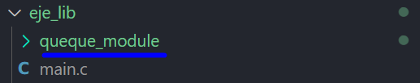

# QUEUE_MODULE

This project is a library (queue_module.c/h files) which helps to generate a basic circular and static queue.

The project purpose is to give an example or a base for a general queue where the user change the MAX_ELEM_QUEUE
macro value and adds more type of elements at his convenience,
e. g., an structure array. 
 
## Example main.c code

The next code is an example of how the library can work:

```
#include "queue_module.h"

int main(int argc, char const *argv[])
{
    Cola_t cola;
    create_queue(&cola);

    for(int i = 1; i < 7; i++)
        cola.put(&cola, 10*i);
    
    printf("queue peek: %d\n", cola.peek(&cola));

    for(int i = 0; i < MAX; i++)
        printf("Dequeue: %d\n", cola.pop(&cola));

    printf("queue peek: %d\n", cola.peek(&cola));
    return 0;
}
```
1. Create a queue instance
   ```
   Cola_t cola;
   create_queue(&cola);
   ```
2. Use the put method to enqueue elements
   ```
   cola.put(&cola, 10*i);
   ```
3. Use peek method to see the next element to pull it from
   the queue
   ```
   cola.peek(&cola);
   ```
4. Use pop method to pulls the next element from the queue
   ```
   cola.pop(&cola);
   ```

**Example output:**
```
Inserted: 10
Inserted: 20
Inserted: 30
Inserted: 40
Inserted: 50
The queue is full
Queue peek: 10
Dequeue: 10
Dequeue: 20
Dequeue: 30
Dequeue: 40
Dequeue: 50
The queue is empty
Queue peek: -1
```

## Compilation
First you have to download the library (or to clone or to add to your project like a submodule). 
The library location should look as follows:


Then, the next step for compilation it can be realized using the next gcc command on the terminal:

```
gcc -g main.c queque_module/queue_module.c -I queque_module -o main.exe
```

## Execution
To excecute the main.exe file you can use the next command:
```
.\main.exe
```

## Message
I hope you enjoy with this code, I know there are many ways to learn the concept of a queue but I hope this example helps you. Remember, a basic queue have three attributes (element array, front, rear) and six or five methods (init queue, check empty queue, check full queue, enqueue elements, 
dequeue elements and optional, shows the queue peek).

And remember use

👍"Hello Dog! 🐶"

Instead 

✖️"Hello World!"


